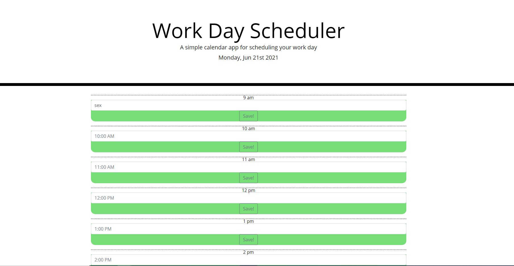
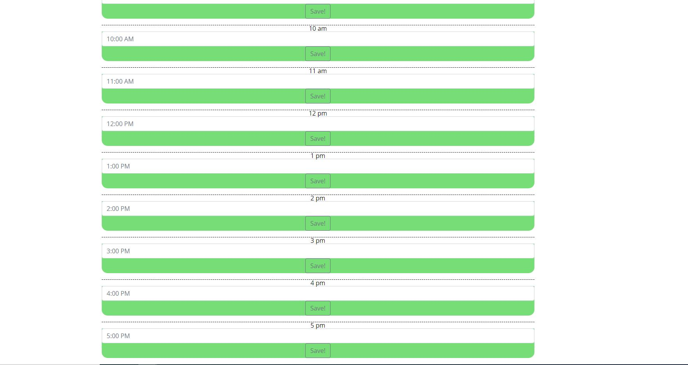

My objective was to complete a schedule planner for saving local data after user input

Used bootstrap for the forms and used jQuery as much as I could in the Javascript.

When initially looking at the header
the header reads the current day.
When looking at the hours in the day
the colors correspond with the current hour.
When clicking the button "save!"
the button saves the input locally

my local input was working while I was working with my tutor but now it will only do the 9am save.
the color input was working as well but it is so late when I am finishing up that I cannot see the colors.

